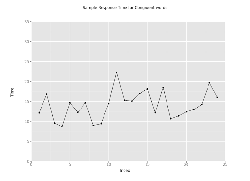
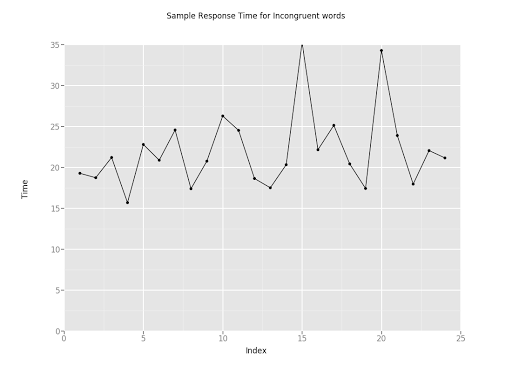
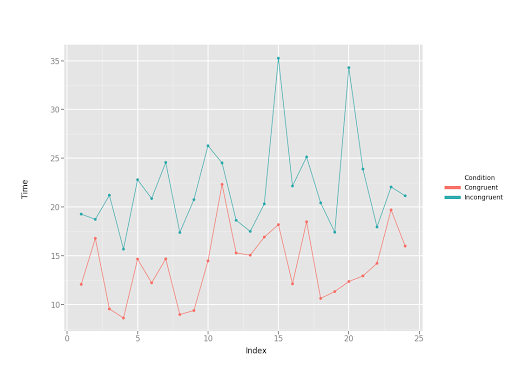

# Test a Perceptual Phenomenon
This is a project from the **Statistics** module of **Udacity Machine Learning Foundation Nanodegree**. Use descriptive statistics and a statistical test to analyze the Stroop effect, a classic result of experimental psychology.

## Project Overview 
In this project, you will investigate a classic phenomenon from experimental psychology called the Stroop Effect. Here you will create a hypothesis regarding the outcome of the task, then go through the task yourself. You will then look at some data collected from others who have performed the same task and will compute some statistics describing the results. Finally, you will interpret your results in terms of your hypotheses.

**Dataset:** [View CSV](./stroopdata.csv)

## Questions for investigation
#### 1. What is our independent variable? What is our dependent variable?
**Independent variable:** Condition (congruent/incongruent)    
**Dependent variable:** Time to name ink colours
#### 2. What is an appropriate set of hypotheses for this task? What kind of statistical test do you expect to perform?
**Hypothesis test**

**H0:** Time to name colours is the same for congruent and incongruent tasks

**HA:** Time to name colours is not the same for congruent and incongruent tasks

**Statistical test**

| **Statistic** | **Congruent** | **Incongruent** |
| ------------- | ------------- | ------------- |
| n  | 24 | 24 |
| x̅  | 14.05 | 22.02 |
| Median | 14.36 | 21.02 |
| s² | 12.67 | 23.01 |
| s | 3.56 | 4.80 |
| SE | 0.73 | 0.98 |
#### 4. Provide one or two visualizations that show the distribution of the sample data. Write one or two sentences noting what you observe about the plot or plots.
###### a. Time taken by participant to name the ink colors in congruent condition

###### b. Time taken by participant to name the ink colors in incongruent condition

###### c. Comparison plot for congruent/incongruent plots

The congruent words sample has a distribution which is between 8 and 22 seconds and has a lower average completion time compared to the incongruent words which shows the distribtuion is between 15 to about 26 seconds with a couple of outliers. Congruent tasks appear to be consistently completed faster than incongruent tasks.
#### 5. Now, perform the statistical test and report your results. What is your confidence level and your critical statistic value? Do you reject the null hypothesis or fail to reject it? Come to a conclusion in terms of the experiment task. Did the results match up with your expectations?

µD= -7.9648    
S= 4.86482691    
df= 23    
t-stat= -8.020706944    
at α 0.05, t-critical: -2.06865761; 2.06865761    
P= 4.103E-08    
95% CI= (-25.3527231, 9.42314)

**Null hypothesis rejected.** At α 0.05, the time to name colours is significantly different between congruent and incongruent tasks. People do not name colours at the same speed when the word’s meaning and its colour match, as when they do not match. The result confirms my expectations. 
